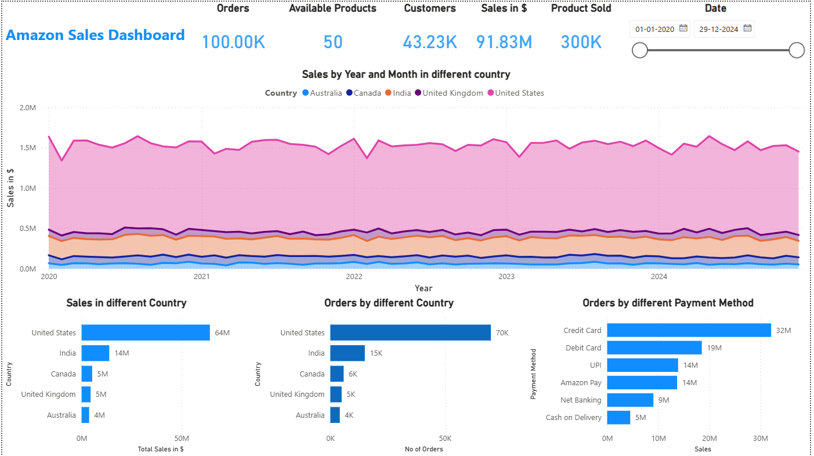
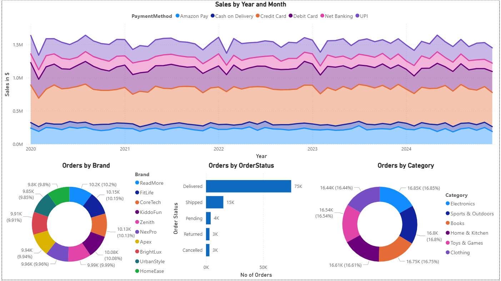
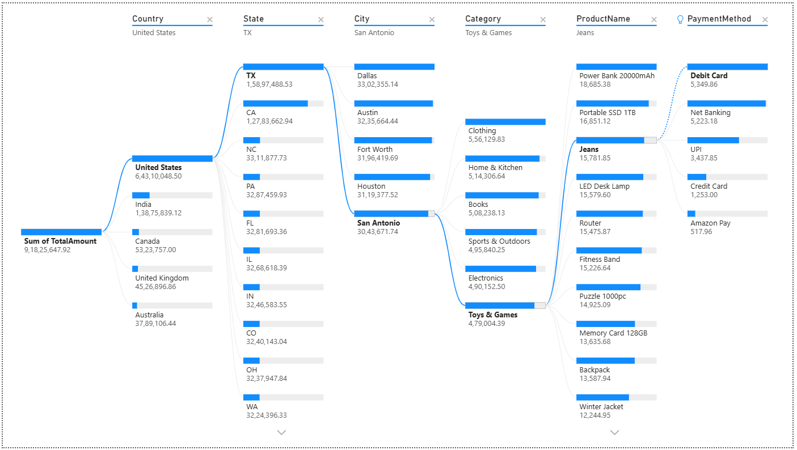

# 🛒 Amazon Data Platform: End-to-End Engineering & Analytics

## 📊 Project Overview

This project is a comprehensive **data platform** designed to ingest, process, and analyze large-scale Amazon retail data. It bridges the gap between **raw, unstructured data and executive-level decision-making** through a **7-stage automated pipeline** and a **dynamic Power BI dashboard**.

---

# 🛠️ Tech Stack

### Data Processing
- PySpark
- Pandas
- NumPy

### Statistical Analysis
- SciPy
- Statsmodels *(VIF Analysis)*

### Machine Learning
- Scikit-Learn *(K-Means Clustering, PCA)*

### Visualization
- Matplotlib
- Seaborn
- Power BI

### Environment
- GitHub Codespaces
- Jupyter Notebooks

---

# 🏗️ The 7-Stage Pipeline

The project is structured into **seven sequential notebooks**, ensuring a **modular and scalable ETL process**.

### 1️⃣ Ingestion
Raw data extraction and schema definition using **PySpark**.

### 2️⃣ Cleaning
Advanced handling of **missing values, duplicates, and data type standardization**.

### 3️⃣ Exploratory Data Analysis (EDA)
Deep-dive exploratory analysis into **sales trends and seasonal patterns**.

### 4️⃣ Feature Engineering
Deriving business KPIs such as:

- Customer Lifetime Value (CLV)
- Churn Probability
- Purchase Frequency

### 5️⃣ Statistical Validation
Rigorous testing for **multicollinearity** using **Variance Inflation Factor (VIF)**.

### 6️⃣ Machine Learning Clustering
Customer segmentation using:

- **K-Means Clustering**
- **Silhouette Score optimization**
- **Principal Component Analysis (PCA)** for visualization.

### 7️⃣ Product Recommendation System
Built a **product recommendation model** to suggest relevant products to customers based on purchasing patterns and behavioral similarities.

Key techniques include:

- Similarity-based recommendation logic
- Customer purchase pattern analysis
- Data-driven product suggestions

The final output can be integrated into **recommendation engines** to support personalized marketing and product discovery.

---

# 🚀 How to Use

## 1️⃣ Clone the Repository

```bash
git clone https://github.com/SaiPavanVetcha/end-to-end-amazon-data-platform.git
cd end-to-end-amazon-data-platform
```

## 2️⃣ Install Dependencies

```bash
pip install -r requirements.txt
```
## 3️⃣ Run the Notebooks

Open the notebooks/ folder and execute the notebooks 01 → 07 sequentially.


---

# 📊 Dataset

The project uses the following dataset:

- **Amazon sales dataset.csv**

This dataset contains transaction-level Amazon retail sales data used for:

- Sales trend analysis
- Customer segmentation
- KPI generation
- Machine learning modeling

---

# 📊 Power BI Dashboard

The project includes a **Power BI dashboard**:

**File:**  
`dashboard/Amazon Sales dashboard.pbix`

The dashboard provides insights into:

- Revenue trends
- Customer segmentation
- Fulfillment performance
- Business KPIs

---

# 🖼️ Dashboard Screenshots







# 📂 Project Structure
```
end-to-end-amazon-data-platform/
│
├── data/
│   └── Amazon sales dataset.csv
│
├── notebooks/
│   ├── 01_data_ingestion_and_validation.ipynb
│   ├── 02_data_cleaning.ipynb
│   ├── 03_exploratory_data_analysis.ipynb
│   ├── 04_feature_engineering.ipynb
│   ├── 05_statistical_testing.ipynb
│   ├── 06_ml_modeling.ipynb
│   └── 07_recommendation_system.ipynb
│
├── dashboard/
│   ├── Amazon Sales dashboard.pbix
│   ├── screenshot1.png
│   ├── screenshot2.png
│   └── screenshot3.png
│
├── .gitignore
├── requirements.txt
└── README.md
```
